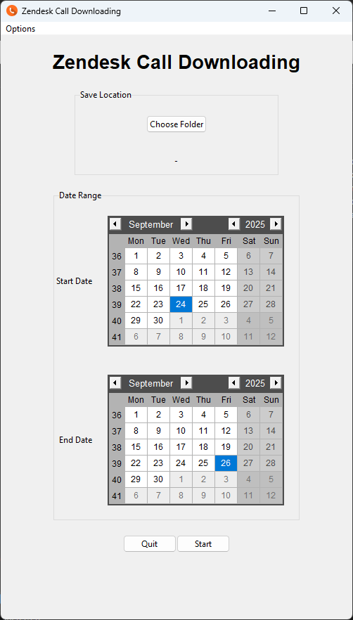

# Zendesk Call Downloader

This program allows for a user to download call recordings for every Zendesk ticket found in a specified date range. Useful if you want to offload call recording external storage and free up space on your Zendesk account.

The program uses the Zendesk API to make calls for ticket information and is written in Python using additional libraries for the UI and storing user settings. The UI is created using the Tkinter Python Library, which does the job, even if it isn't the most modern looking.

The options menu gives you the ability to change the credentials that are used to access the Zendesk API and some basic preferences such as file extension.

## To access the Zendesk API for your domain, you'll need the following information:
 ### Your Zendesk domain
 Your Zendesk domain can be found in the URL of your Zendesk dashboard and is usually your organisation's name.

 e.g. In the URL 'yourcompany.zendesk.com', 'yourcompany' would be your domain (minus the quotes).

 ### Your Email
 This will be the email that you use with your Zendesk user. It can be found by viewing your profile in the top right of Zendesk.

 e.g. yourname@yourcompany.com

 ### Your API Token
 To generate an API Token for the program to use, you'll need to have access to the Zendesk Admin Panel. In the admin panel, under 'Apps and integrations' > 'APIs' > 'API tokens', you can add a new token using the button in the top right. It's recommended to create a new token for each new application or service you connect to Zendesk using the API.

 ## Dependencies
 To install all dependencies that the program needs to run and build, you can use the following command in the terminal (assuming you have pip installed on your machine or virtual environment):

 `pip install -r requirements.txt`

 ## Building an .exe
 To build the Python program into an .exe file, you can use 'pyinstaller' in the terminal by running the following command:

 `pyinstaller main.pyw --distpath "<path/to/folder>" --workpath "<path/to/folder>" --noconsole --onefile --icon=zendesk_call_downloader.ico --name "Zendesk Call Downloader"`

 ## Repo Maintaining
 This project is uploaded to a Github account managed linked to a company managed email address. You can find my personal account at [Pricey1600](https://github.com/Pricey1600).